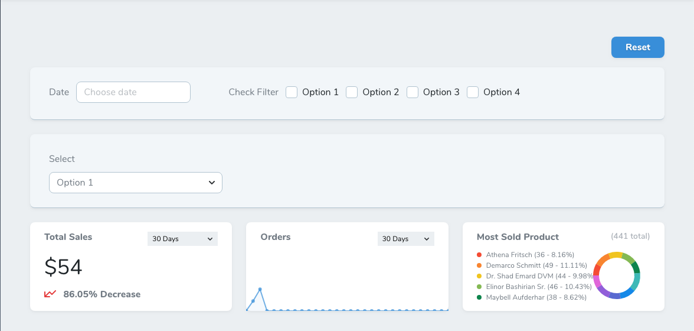

# Nova Global Filter

[](https://packagist.org/packages/marshmallow/nova-global-filter)
[](https://packagist.org/packages/marshmallow/nova-global-filter)

This package allows you to broadcast any of your existing Laravel Nova filters to metrics or custom cards.


> [!important]
> This package was originally forked from [nemrutco/nova-global-filter](https://github.com/nemrutco/nova-global-filter). Since we were making many opinionated changes and the owner archived the repository, we decided to continue development in our own version rather than submitting pull requests that might not benefit all users of the original package. You're welcome to use this package, we're actively maintaining it. If you encounter any issues, please don't hesitate to reach out.

## Installation

You can install the package into a `Laravel` app that uses [Nova](https://nova.laravel.com) via composer:

```bash
composer require marshmallow/nova-global-filter
```

The card is registered automatically through Laravel package auto-discovery, so there are no extra setup steps.

## Usage

In this example, we are registering a few `Metric Cards` and the `Global Filter` with a `Date` filter as:

```php
...
use Marshmallow\NovaGlobalFilter\NovaGlobalFilter;
use App\Nova\Filters\Date;

class Store extends Resource
{
  ...
  public function cards(Request $request)
  {
    return [
      new TotalSales, // Value Metric

      new Orders, // Trend Metric

      new MostSoldProduct, // Partition Metric

      // NovaGlobalFilter
      new NovaGlobalFilter([
        new Date, // Date Filter
      ]),
    ];
  }
  ...
}
```

And now `metric cards` or any `other cards` optimized to listen to `GlobalFilter` can be filtered by using the `GlobalFilterable` trait and calling the `$this->globalFiltered($request, $model, $filters)` method.

The `globalFiltered($request, $model, $filters = [])` method expects the `$request`, `$model` and `$filters` parameters:

```php
use Marshmallow\NovaGlobalFilter\GlobalFilterable;
use App\Nova\Filters\Date;
...

class UsersPerDay extends Trend
{
  use GlobalFilterable;

  public function calculate(NovaRequest $request)
  {
    // Filter your model with existing filters
    $model = $this->globalFiltered($request, Store::class, [
      Date::class // DateFilter
    ]);

    // Do your thing with the filtered $model
    return $this->countByDays($request, $model);
  }
...
}
```

And that's it. Cards will be filtered based on the passed filter value.


If you want to apply a default value on the initial request, make sure you set the default value in your filter as:

```php
...
// set default date
public function default()
{
    return Carbon::now();
}
...
```

To change the layout from `grid` to `inline`

*by default it's set to `grid`*



```php
...
(new NovaGlobalFilter([
    // Filters
]))->inline(),
...
```

To enable the `Reset` button:

```php
...
(new NovaGlobalFilter([
    // Filters
]))->resettable(),
...
```

To add multiple `Global Filter`s:

```php
...
(new NovaGlobalFilter([
    // Filters
]))->inline()->resettable(),

(new NovaGlobalFilter([
    // Filters
]))->onlyOnDetail(),
...
```

To set the card width (`1/3`, `1/2`, or `full` — defaults to `full`):

```php
...
(new NovaGlobalFilter([
    // Filters
]))->width('1/2'),
...
```

To listen to the `Global Filter` on any `Custom Card`s:

```js
...
created() {
  Nova.$on("global-filter-changed", filter => {
    // Do your thing with the changed filter
    console.log(filter);
  });
},
...
```

To request all filter states from the `Global Filter` on any `Custom Card`s:

```js
...
  Nova.$emit("global-filter-request");
...
```

To request specific filter states from the `Global Filter` on any `Custom Card`s:

```js
...
created() {
  Nova.$emit("global-filter-request", [
      "App\\Nova\\Filters\\DateFilter",
      "App\\Nova\\Filters\\CountryFilter"
  ]);
},
...
```

To receive filter states from the `Global Filter` on any `Custom Card`s:

```js
...
created() {
  Nova.$on("global-filter-response", filters => {
    // Do your thing with the filters
    console.log(filters);
  });
},
...
```

## Good to know

- The basic functionality of this package is that it listens to all the assigned filters. Once the value of a filter is changed, it emits `Nova.$on('global-filter-changed', [changed filter and value])`. So any card that listens to this event will receive the filter and its value.
- This package overwrites Nova's default `Metric Card`s to allow them to listen to the `"global-filter-changed"` event. Make sure there are no conflicts with other packages.
- This package currently does not support Index view filters to be synchronized. So filters in the `Global Filter` will not trigger an update of the filters in the `Filter Menu` of your Index view.
- The `Reset` button simply reloads the current page. There is nothing fancy going on behind the scenes.

## Security Vulnerabilities

Please report security vulnerabilities by email rather than via the public issue tracker.

## Credits

This package is maintained by [Marshmallow](https://marshmallow.dev). It builds on the original work of:

- [Nemrut Creative Studio](https://nemrut.co)
- [Muzaffer Dede](https://github.com/muzafferdede)
- [nemrutco/nova-global-filter](https://github.com/nemrutco/nova-global-filter)
- [All Contributors](https://github.com/marshmallow-packages/nova-global-filter/contributors)

Made with ❤️ for open source.

## License

The MIT License (MIT). Please see the [License File](LICENSE.md) for more information.
